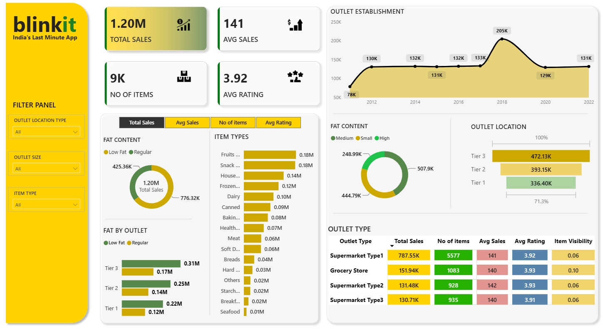

# 🛒 Blinkit Sales Analysis Dashboard | Power BI


---

# 📌 Project Overview

This project presents an interactive **Power BI dashboard** developed to analyze Blinkit's grocery sales performance. The dashboard provides valuable business insights into sales trends, customer satisfaction, outlet performance, inventory distribution, and product categories using KPIs and interactive visualizations.

The primary objective is to help stakeholders make data-driven decisions by monitoring key business metrics and identifying opportunities for business growth.

---

# 🎯 Business Objective

The objective of this project is to:

- Analyze overall sales performance.
- Evaluate customer satisfaction using ratings.
- Compare sales across outlet locations and outlet types.
- Understand product category performance.
- Identify the impact of fat content on sales.
- Monitor inventory distribution across different outlets.

---

# 📊 Dashboard KPIs

| KPI | Value |
|------|-------|
| 💰 Total Sales | **1.20 Million** |
| 📈 Average Sales | **141** |
| 📦 Number of Items | **9,000+** |
| ⭐ Average Rating | **3.92** |

---

# 📈 Dashboard Features

## 1️⃣ Sales Performance

- Total Sales
- Average Sales
- Number of Items
- Average Rating

---

## 2️⃣ Product Analysis

- Sales by Item Type
- Sales by Fat Content
- Fat Content Distribution

---

## 3️⃣ Outlet Analysis

- Sales by Outlet Size
- Sales by Outlet Location
- Sales by Outlet Type
- Outlet Establishment Trend

---

## 4️⃣ Customer Insights

- Average Customer Rating
- Item Visibility
- Product Distribution

---

# 📌 Key Business Insights

- Total sales reached **1.20 Million**.
- More than **9,000 products** were analyzed.
- Average sales per item are **141**.
- Average customer rating is **3.92**.
- Tier 3 outlets generated the highest revenue.
- Supermarket Type1 contributed the highest sales.
- Fruits & Vegetables and Snack Foods are the top-performing categories.
- Regular Fat products generated higher revenue than Low Fat products.
- Outlet establishment year 2018 recorded the highest sales performance.

---

# 📊 Dashboard Preview



---

# 🛠️ Tools & Technologies Used

- Microsoft Power BI
- Power Query
- DAX (Data Analysis Expressions)
- CSV Dataset
- Data Modeling
- Data Cleaning
- Data Visualization

---

# 📂 Project Structure

```
blinkit-sales-analysis-powerbi/
│
├── Blinkit_Sales_Dashboard.pbix
├── BlinkIT Grocery Data.csv
├── Dashboard.png
├── README.md
└── LICENSE
```

---

# 📈 Dashboard Visualizations

✔ KPI Cards

✔ Sales by Fat Content

✔ Sales by Item Type

✔ Fat Content by Outlet

✔ Outlet Establishment Trend

✔ Sales by Outlet Size

✔ Sales by Outlet Location

✔ Outlet Type Analysis

✔ Customer Rating

---

# 📚 Business Requirements Covered

### KPI Requirements

- Total Sales
- Average Sales
- Number of Items
- Average Rating

### Chart Requirements

- Total Sales by Fat Content
- Total Sales by Item Type
- Fat Content by Outlet
- Sales by Outlet Establishment
- Sales by Outlet Size
- Sales by Outlet Location
- Outlet Type Performance

---

# 💡 Skills Demonstrated

- Data Cleaning
- Data Transformation
- Data Modeling
- DAX Calculations
- Business Intelligence
- Dashboard Design
- Interactive Reporting
- Data Visualization
- Analytical Thinking

---

# 🚀 Project Highlights

- Interactive dashboard with slicers.
- Dynamic KPI cards.
- Business-focused insights.
- Professional dashboard design.
- Optimized DAX measures.
- Clean and structured data model.

---

# 📥 Dataset

Dataset used in this project contains Blinkit grocery sales information including:

- Item Details
- Outlet Information
- Sales
- Ratings
- Fat Content
- Item Visibility
- Outlet Size
- Outlet Location
- Outlet Type

---

# ⭐ Repository Topics

```
powerbi
dashboard
business-intelligence
data-analysis
dax
power-query
analytics
retail
sales-dashboard
data-visualization
blinkit
csv
```

---

# 👨‍💻 Author

## Abhi Bhardwaj

**Aspiring Data Analyst**

### Connect with Me

- 💼 LinkedIn: https://www.linkedin.com/in/abhi-bhardwaj-660286360
- 💻 GitHub: https://github.com/Abhibhardwaj02

---

# 🌟 If you found this project helpful, please consider giving it a ⭐ on GitHub!
